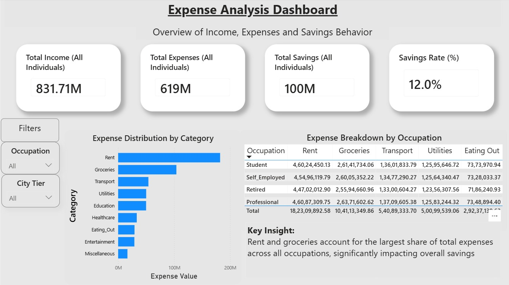
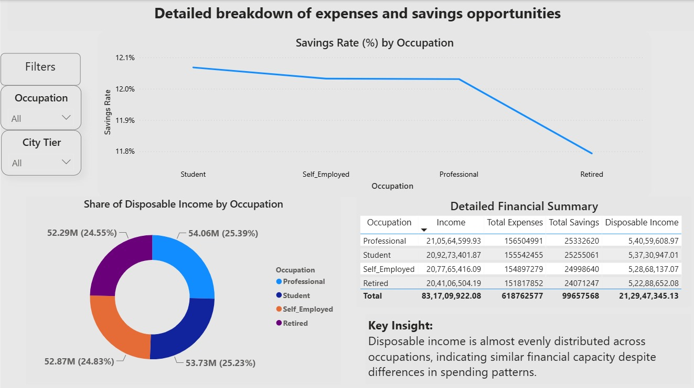

# 📊 Expense Analysis Dashboard (Power BI)


## 🚀 Project Overview

An interactive Power BI dashboard built using **20,000+ financial records**, **Power Query**, **Data Modeling**, and **10+ DAX Measures** to analyze income, expenses, savings behavior, and potential savings opportunities across occupations and city tiers.

The dashboard helps identify spending patterns, evaluate financial health, compare occupation-wise performance, and uncover opportunities to improve savings.

---

## 🎯 Business Objective

The objective of this project is to:

- Analyze income and expense patterns.
- Measure savings performance across different occupations.
- Understand the impact of spending behavior on disposable income.
- Identify major expense drivers.
- Discover potential savings opportunities.
- Enable interactive analysis through filters and visualizations.

---

## 📂 Dataset Information

| Metric | Value |
|----------|----------|
| Total Records | 20,000 |
| Features | 27 |
| Dataset Type | Financial & Demographic |
| Format | CSV |

### Key Attributes

- Income
- Occupation
- City Tier
- Rent
- Groceries
- Transport
- Utilities
- Education
- Healthcare
- Entertainment
- Insurance
- Loan Repayment
- Disposable Income
- Desired Savings
- Potential Savings Category

---

## 📈 Key Performance Indicators (KPIs)

### 💰 Total Income
Total income generated across all individuals.

**Value:** ₹831.71M

### 💸 Total Expenses
Total expenses incurred across all categories.

**Value:** ₹619M

### 🏦 Total Savings
Total savings accumulated by all individuals.

**Value:** ₹100M

### 📊 Savings Rate
Percentage of income retained as savings.

**Value:** 12.0%

### 💵 Disposable Income
Remaining income after all expenses are deducted.

### 📉 Expense Ratio
Measures how much income is consumed by expenses.

### 🎯 Potential Savings Value
Estimated amount that could potentially be saved by optimizing spending behavior.

---

## 📐 DAX Measures Used

This project uses custom DAX measures for dynamic KPI calculations and business insights.

| Measure |
|----------|
| Total Income |
| Total Expenses |
| Total Savings |
| Disposable Income |
| Savings Rate |
| Expense Ratio |
| Expense Ratio % |
| Potential Savings Value |
| Total Potential Savings |
| Top Expense Category |
| Top Expense Value |

---

## 📊 Dashboard Pages

### 1️⃣ Executive Overview

Provides a high-level financial summary with key metrics and expense insights.

#### Features

- Total Income KPI
- Total Expenses KPI
- Total Savings KPI
- Savings Rate KPI
- Expense Distribution by Category
- Expense Breakdown by Occupation
- Occupation Filter
- City Tier Filter

#### Dashboard Preview



#### Key Insight

Rent and groceries account for the largest share of total expenses across all occupations, significantly impacting overall savings.

---

### 2️⃣ Detailed Financial Analysis

Provides deeper analysis of savings performance and financial behavior across occupations.

#### Features

- Savings Rate by Occupation
- Disposable Income Distribution
- Financial Summary Table
- Occupation Comparison
- Interactive Filters

#### Dashboard Preview



#### Key Insight

Disposable income is distributed relatively evenly across occupations, indicating similar financial capacity despite differences in spending behavior.

---

## 📊 Expense Category Analysis

### Major Expense Categories

1. Rent
2. Groceries
3. Transport
4. Utilities
5. Education
6. Healthcare
7. Entertainment
8. Miscellaneous

### Findings

- Rent is the highest expense category.
- Groceries are the second-largest expense category.
- Housing and living costs have the greatest impact on savings.
- Spending patterns vary across occupations while savings rates remain relatively stable.

---

## 🔍 Interactive Features

✅ Occupation-wise filtering

✅ City Tier filtering

✅ Dynamic KPI calculations

✅ Cross-filtering between visuals

✅ Occupation comparison

✅ Financial summary analysis

---

## 🛠️ Tools & Technologies

### Business Intelligence
- Power BI Desktop

### Data Preparation
- Power Query

### Data Modeling
- Relationships
- Measures Table

### Analytics
- DAX Measures
- KPI Calculations
- Financial Analysis

### Dataset
- CSV File

---

## 📁 Project Structure

```text
expense-analysis-dashboard-powerbi/
│
├── Expense_Analysis_Dashboard.pbix
├── expense_analysis_data.csv
├── overview-dashboard.jpeg
├── detailed-analysis.jpeg
└── README.md
```

---
